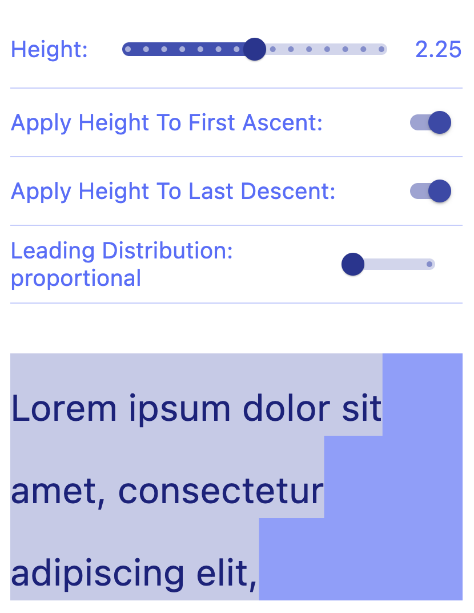
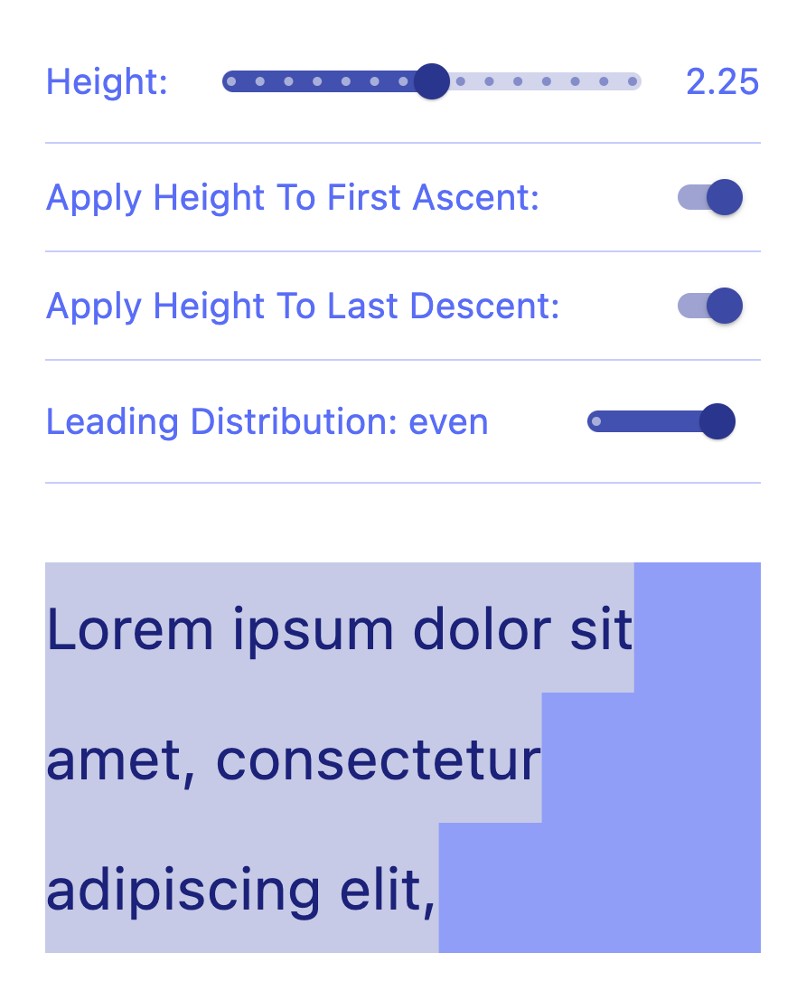

# Flutter Text Height Example

Font Height Playground, assign different values and see how render changes.
> Leading distribution behavior update seems to be bugged in text widget.

Main purpose is to show how default `TextLeadingDistribution.proportional` 
Flutter behavior is different from Figma text height behavior, which 
could be enabled with `TextLeadingDistribution.even`.

<table>
  <tr>
     <td>TextLeadingDistribution.proportional</td>
    <td>TextLeadingDistribution.even</td>
  </tr>
  <tr>
    <td></td>
    <td></td>
  </tr>
 </table>

 

###  Bonus: canvas snow animation on appbar action toggle
